<h3><code>meet@github ~ $ ./contributions.sh</code></h3>

  

<h3><code>meet@github ~ $ whoami</code></h3>

<table>
<tr>
<td valign="top"></td>
<td valign="top"></td>
</tr>
</table>

 

<code>meet@github ~ $ cat /etc/motd</code>

Building software, breaking assumptions, and shipping things that actually work.

<a href="https://github.com/Meet141106">GitHub</a>

